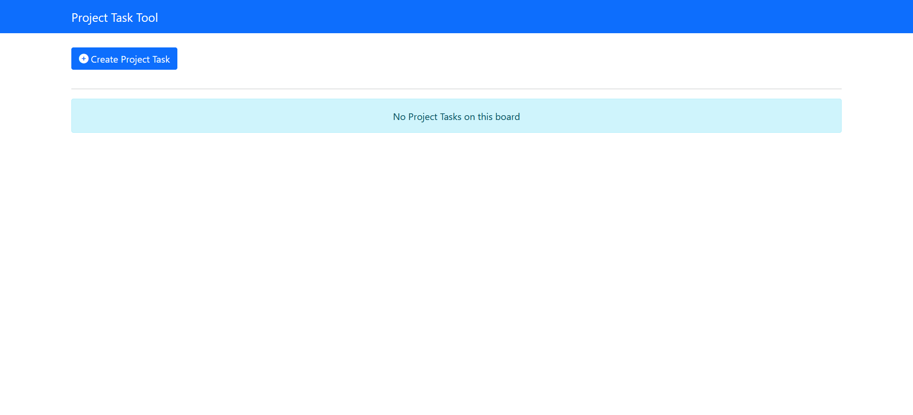
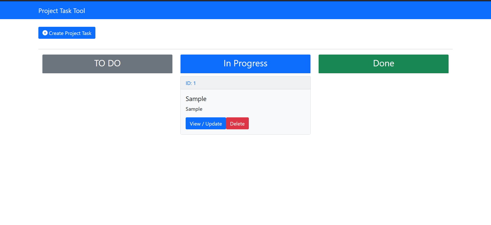

# Project Board
### Manage your ideas using cards

## Technologies used
- Spring Boot (Java)
- React
- Redux

## Running the project
### Running Spring Boot app
- First, cd into spring project
```bash
cd ./project-board-spring
```
- Run the maven project
```bash
./mvnw spring-boot:run
```
- The application makes use of in-memory H2 database. Please add your own settings for persistence database of your choice. The app also makes use of **JPA** as ORM.

### Running React app
- Make sure the Spring Boot appis running on the default configured port, `8080`.
- cd into React Project
```bash
cd ./project-board-react
```
- Install dependencies
```bash
npm install
```
- Start the application
```bash
npm start
```
- Open browser on [http://localhost:8000](http://localhost:8000).

## Screenshots
- When there are no projects

- Project added

